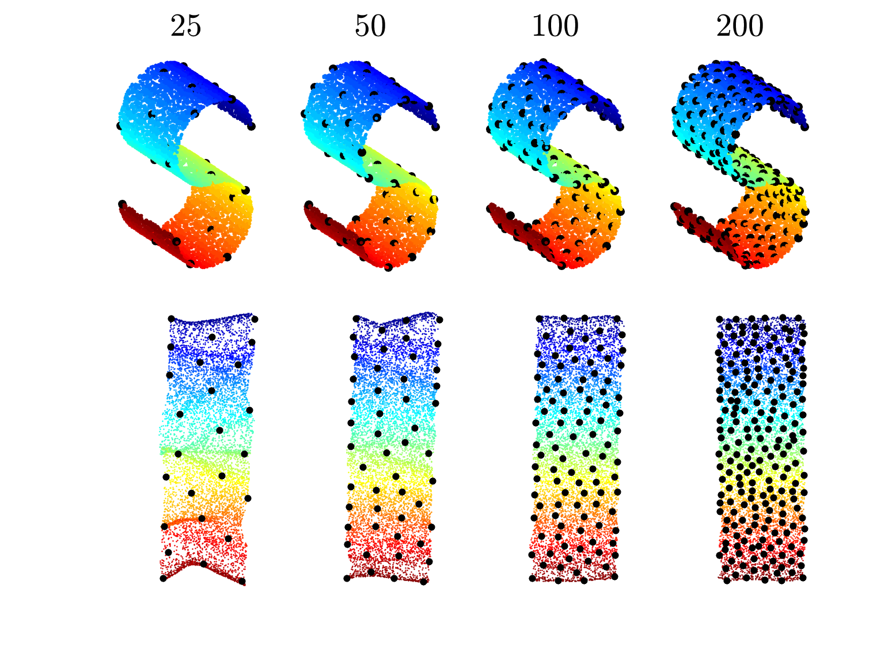

# DIMAL: Deep Isometric Manifold Learning Using Sparse Geodesic Sampling

This is a sample demo-code for the following papers:

1. DIMAL: Deep Isometric Manifold Learning Using Sparse Geodesic Sampling, [Gautam Pai](https://sites.google.com/view/paigautam/home), [Ronen Talmon](https://ronentalmon.com/), [Alex Bronstein](https://bron.cs.technion.ac.il/) and [Ron Kimmel](https://www.cs.technion.ac.il/~ron/),  IEEE Winter Conference On Applications Of Computer Vision (WACV) 2019,  

[Paper](https://arxiv.org/pdf/1711.06011.pdf), [Poster](https://drive.google.com/file/d/1dS__6i5QTF6mwR-07UvgzYqy-rz4awqx/view), [Slides](https://drive.google.com/file/d/1qqfyWL2QDUdeGH5X1HAqcZ5yQ_7sasex/view)

2. Deep Isometric Maps,  [Gautam Pai](https://sites.google.com/view/paigautam/home), [Alex Bronstein](https://bron.cs.technion.ac.il/), [Ronen Talmon](https://ronentalmon.com/), and [Ron Kimmel](https://www.cs.technion.ac.il/~ron/), Elsevier - Image and Vision Computing ([Special Issue](https://www.sciencedirect.com/journal/image-and-vision-computing/special-issue/10NN8F4S54H) on Learning with Manifolds in Computer Vision), 2022  
[Paper](https://www.sciencedirect.com/science/article/pii/S0262885622000907)



## Main Functions
Start with ```FPS_Single_Display.py``` for a basic demo of the method on the S-Curve manifold. Implemented with Pytorch. 
